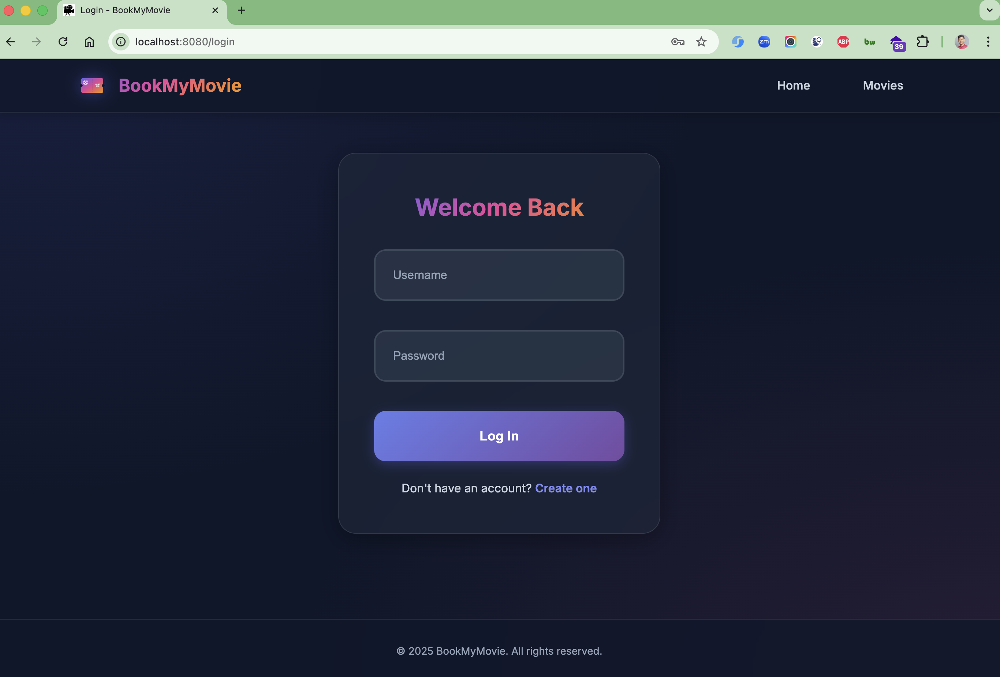

# BookMyMovie

A comprehensive movie booking system built with Spring Boot that allows users to browse movies, view screenings, and
book seats at various theaters.

## Features

- **User Authentication & Authorization**: Secure login/registration system with Spring Security
- **Movie Management**: Browse and search available movies
- **Theater & Screening Management**: View movie screenings across different theaters and screens
- **Seat Booking**: Interactive seat selection and booking system
- **Responsive Web UI**: Built with Thymeleaf templates and modern CSS
- **Data Persistence**: MySQL database with Flyway migrations
- **RESTful APIs**: Well-structured REST endpoints for all operations

## Technology Stack

- **Backend**: Spring Boot 3.5.5, Java 21
- **Security**: Spring Security 6 with Thymeleaf integration
- **Database**: MySQL 9.4.0 with H2 for testing
- **ORM**: Spring Data JPA with Hibernate
- **Migration**: Flyway for database versioning
- **Frontend**: Thymeleaf, HTML5, CSS3, JavaScript
- **Build Tool**: Maven
- **Containerization**: Docker Compose
- **Additional Libraries**: Lombok, JSoup, Spring Boot DevTools

## Image Screenshots

Login Page



Theatres Page


Now Showing Page


Booking Error


## Project Structure

```
src/main/java/com/hendisantika/bookmymovie/
├── entity/          # JPA entities (Movie, Theater, Screening, Seat, etc.)
├── repository/      # Spring Data JPA repositories
├── service/         # Business logic layer
├── controller/      # REST controllers
├── config/          # Security and application configuration
├── validator/       # Custom validation logic
└── runner/          # Data loading utilities

src/main/resources/
├── templates/       # Thymeleaf HTML templates
├── static/          # CSS, JS, and image assets
├── db/migration/    # Flyway migration scripts
└── application.properties
```

## Prerequisites

- Java 21 or higher
- Docker and Docker Compose
- Maven 3.6+

## Quick Start

### 1. Clone the Repository

```bash
git clone <repository-url>
cd BookMyMovie
```

### 2. Start the Database

```bash
docker-compose up -d mysql
```

### 3. Run the Application

```bash
./mvnw spring-boot:run
```

The application will be available at `http://localhost:8080`

### 4. Default Login Credentials

The application comes with pre-configured user accounts for testing:

| Username | Password |
|----------|----------|
| yuji     | 53cret   |
| geto     | 53cret   |
| gojo     | 53cret   |
| senku    | 53cret   |
| yaiba    | 53cret   |
| tanjiro  | 53cret   |

You can use any of these accounts to log in and test the application.

## Database Configuration

The application uses MySQL as the primary database:

- **Host**: localhost:3308
- **Database**: movies
- **Username**: yu71
- **Password**: 53cret

Database schema is managed through Flyway migrations located in `src/main/resources/db/migration/`.

### phpMyAdmin

For easy database management, phpMyAdmin is available at:

- **URL**: http://localhost:8082
- **Username**: yu71 (or root)
- **Password**: 53cret (or root for root user)

You can use phpMyAdmin to browse tables, run queries, and manage the database through a web interface.

## API Endpoints

### Movies

- `GET /movies` - List all movies
- `GET /movies/{id}` - Get movie details

### Screenings

- `GET /screenings` - List all screenings
- `GET /screenings/{id}` - Get screening details

### Seats

- `GET /seats/{screeningId}` - Get available seats for a screening
- `POST /seats/book` - Book selected seats

### User Management

- `GET /registration` - User registration page
- `POST /registration` - Register new user
- `GET /login` - Login page
- `GET /logout` - Logout

## Development

### Running Tests

```bash
./mvnw test
```

### Building the Application

```bash
./mvnw clean package
```

### Docker Development

```bash
# Start all services
docker-compose up

# Stop services
docker-compose down
```

## Security Features

- CSRF protection enabled
- Session-based authentication
- Password encoding with BCrypt
- Role-based access control
- Secure headers configuration

## Data Loading

The application includes a `DataLoader` that populates the database with:

- Sample movies from CSV files
- Theater and screen configurations
- Default user accounts
- Sample screening schedules

## Contributing

1. Fork the repository
2. Create a feature branch (`git checkout -b feature/amazing-feature`)
3. Commit your changes (`git commit -m 'Add some amazing feature'`)
4. Push to the branch (`git push origin feature/amazing-feature`)
5. Open a Pull Request

## License

This project is licensed under the MIT License - see the LICENSE file for details.
